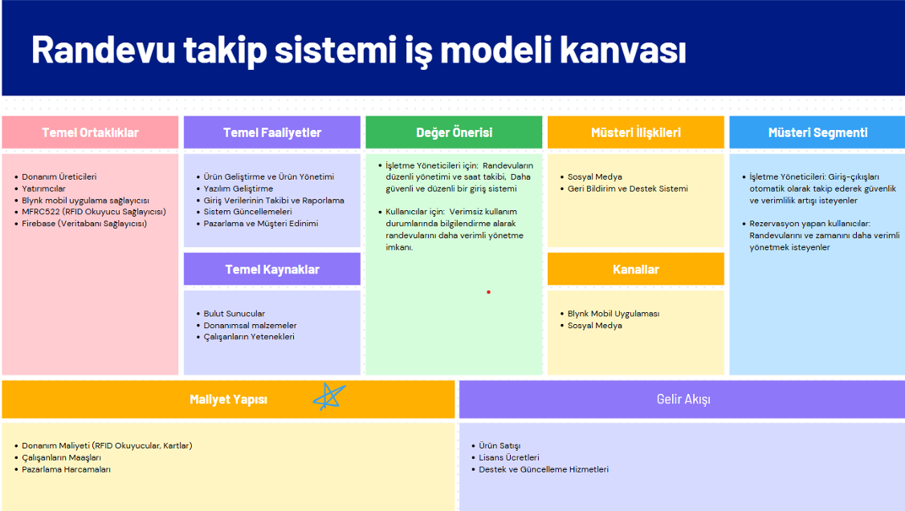
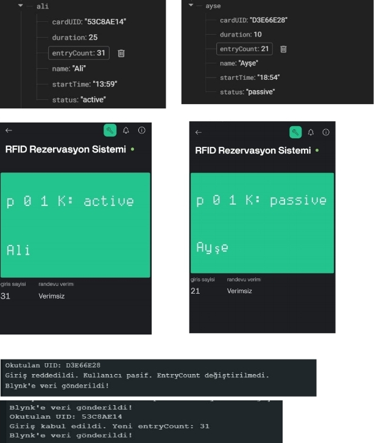
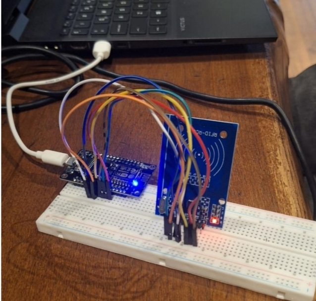

# **Kütüphaneler için RFID Tabanlı Erişim Kontrol Sistemi**

## **Proje Açıklaması**
Günümüzde kütüphaneler gibi alanlarda **rezervasyon yönetimi ve düzenli bir erişim sistemi** sağlamak büyük bir gereklilik haline gelmiştir.  
Bu proje, **RFID tabanlı bir erişim kontrol sistemi** ile bu ihtiyaca çözüm sunmayı amaçlamaktadır.

### **Projenin Odaklandığı Başlıca Problemler**
- **Erişim Kontrolü:** Yalnızca yetkili kullanıcıların planlanan saatlerde giriş yapmasını sağlamak ve yetkisiz erişimi önlemek.  
- **Güvenlik ve Yönetim:** Geleneksel giriş yöntemleri zor kontrol edilebilir ve verimsizdir. Yetkisiz erişim güvenlik risklerine yol açabilir.  
- **Verimlilik:** Kullanıcıların rezervasyon sistemi ile alanı etkin kullanmasını sağlamak, süreyi aşan veya çok sık giriş yapanları tespit etmek.  

**Bu sistem, rezervasyonları takip eder, kullanıcıların belirli saatlerde giriş yapmasına izin verir ve verimlilik ölçümleri yaparak yönetimin etkinliğini artırır.**

---

## **Proje Ekibi**
- **Sadettin Kaya**  
- **Zeynep Uysal**  

---

## **Kullanılan Teknolojiler**
- **NodeMCU ESP8266**  
- **Arduino IDE**  
- **Blynk Mobil Uygulaması**  
- **RFID Kart**  
- **Firebase**  

---

## **İş Modeli (Business Canvas Model)**

---

## **Blynk Uygulaması Ve Firebaseden Görseller**

---

## **Devre Görseli**

---

## **Kurulum ve Kullanım**
1. **Donanım Bağlantıları:**  
   - NodeMCU ESP8266 ve RFID modülünü bağlayın.  
   - RFID kartları sisteme tanımlayın.  

2. **Yazılım Yükleme:**  
   - Arduino IDE ile kodları NodeMCU'ya yükleyin.  
   - Gerekli kütüphaneleri ekleyin (`MFRC522`, `ESP8266WiFi`, `BlynkSimpleEsp8266`).  

3. **Blynk Mobil Uygulaması:**  
   - Blynk hesabınızı oluşturun ve yeni bir proje ekleyin.  
   - Kapı açma butonu, kullanıcı bilgileri ve rezervasyon bildirimleri için bileşenleri ekleyin.  

4. **Veritabanı Entegrasyonu:**  
   - Firebase veya MySQL kullanarak kullanıcı RFID verilerini saklayın.  

5. **Sistemi Test Edin:**  
   - RFID kartlarını okutun ve **Blynk üzerinden kapı açma işlemini test edin**.  

---

## **Gelecekteki Geliştirmeler**
- RFID klonlamaya karşı ek güvenlik önlemleri.  
- Kamera entegrasyonu ile giriş anında kullanıcı görüntüsü kaydı.  
- Daha akıllı rezervasyon yönetimi ve raporlama.  

---

## **Lisans**
Bu proje açık kaynak olup, geliştirmek isteyen herkes katkıda bulunabilir.  

---

